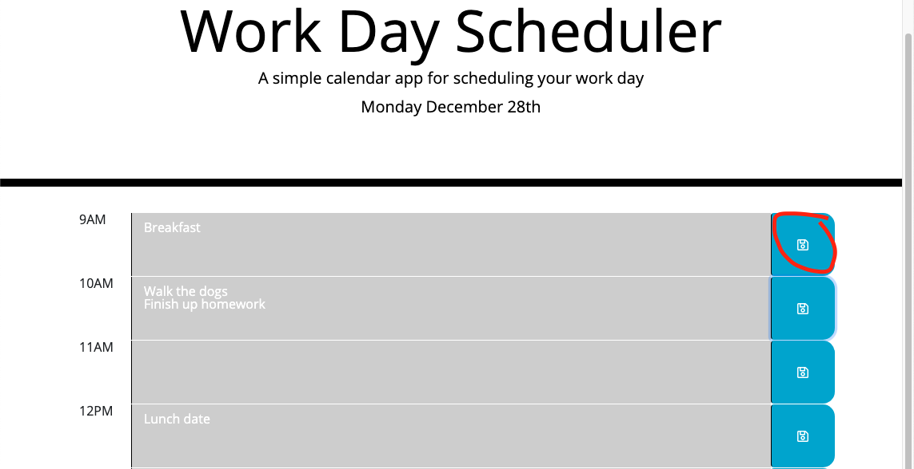

## Event_Planner

## Description
Created  a simple calendar application that allows a user to save events for each hour of the day.

## How to use

1) On the text box next to the time you are able to write anything thats needs to be done. 

2) Once you finish writing, click the save icon (circled in red) to save what needs to be done. 

